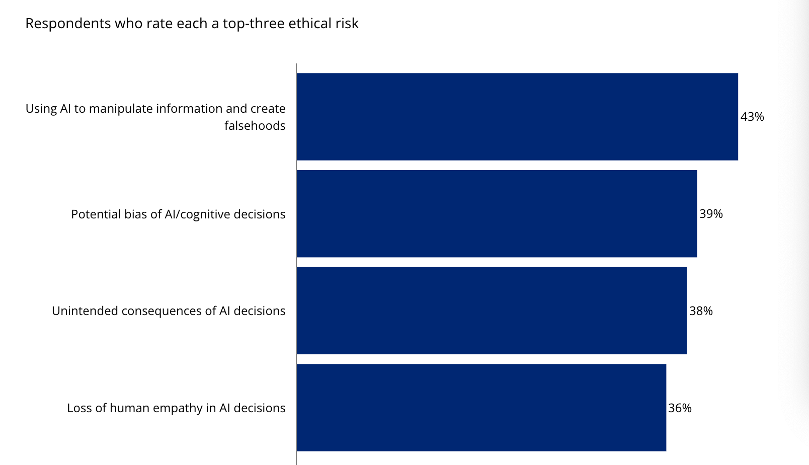
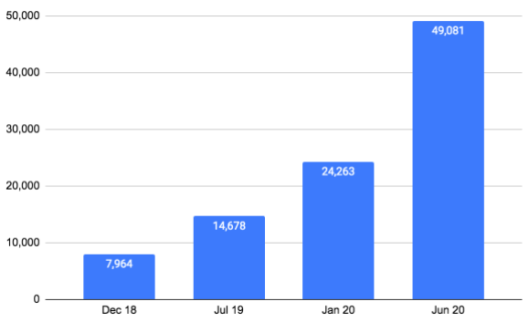

# Ethics Problems On Deepfake Technology

## AI Ethics Problem Discussion Paper 

### COSC276,  2021FALL, FP,  Xuedan Zou

## 1. Deepfake social problem

Imagine one day, there is an app that allows users to upload a female photo, then removes the clothes of that female automatically and shows a generated nude photo in just a few seconds. That is not something in a ficitional porn movie but a real app "Deep Nude" that was once wildly spreaded on the Internet with millions of download times.[1]  In fact, this is just a tip of the iceberg how AI technologies can be used into porn related purposes. Using advanced AI face-changing technology, anyone can now be appreaed in an AI synthetic porn video and as a result causes great damage to the victims both socially and mentally . [2]

Everything begins from the fast development of deep learning technology, especially the GAN technology that allows the computer to generate simu-realistic media contents. Those generated fake contents can be a single image, a video, an audio record or any other media formats. Most importantly, they are so close to the real records that breaks the boundary between real and creation, and confuses the virtual world with our real world. This kind of technology, generally named as **Deep Fake**, combines the newest AI research results in the fields like vision, NLP and graphics, is now becoming an increasing challenge to our society: **"How should we face Deepfake technology for its potential risks to our society ? Should we ban it totally?"** 

Just like only other ethics problems caused by technologies, the real problem does not come from the technology itself but come from the people who use it. Besides its use in porn to joy some specific groups and make extra money to the media creators, this powerful technology can surely causes other greater negative effects. A well-designed fake media contents that seperates to the public can causes credit damage to a business company (In fact, accroding to the Deloitte's survey, the falsehoods created by AI is one of the top ethical risks the bussiness companies face in terms of AI ethics problems. [3]), reduces the public trusts of the public to the media, and even fluctuates the security of a nation and shakes the democracy of the society. Imagine a fake video generated by this AI technology showing negative behaviors of a political elector, how could it harm the democratic election process and manipulate political results? In short, the related stakeholders can use Deepfake technologies whatever they want to meet their interests.

​     *Figure 1: Which of the following ethical risks of AI/cognitive is your company most concerned about?[3]*

And what's worse? Since nowadays most AI researches are open sourced on the Internet, it is in fact not so difficult for normal people to try this Deepfake technology. Using tools like DeepFaceLab, anyone can try this technology, no matter if they want to just have some fun or use it to meet their specific purposes. This surely causes the booming use of Deepfake. According to the statistical result of security analysis company Sensity, there are 49,081 media contents generated by Deepfake on the Internet in June, 2020, and that is a 330% increasment compared with July, 2019! [4] 

​                                 *Figure2: Fast increasment of Deepfake media contents on the Internet [4]*

As we have seen how widely used and how harmful the Deepfake technology can be, goverments from different countries have now been seeking possible meatures to face this risk. The government in the United States has now proposed tha law "DEEP FAKES Accountability Act" in order to limit the use of Deepfake technology on any political use to protect national security.[5]  According to this new law, the creator has the responsibiliy to always add watermarks to those generated contents showing they are fake. The government also established specific groups to track these Deepfake media contents and to develop technologies to help detect those generated fake contents.

While the government tries to restrict the use of Deepfake, many people still argues not banning the Deepfake technology since its positive effects on many fields including accessibility, education, art, autonomy&expression etc. Some people point out that Deepfake can accelerate the accessibility quest to improve equity of our society.  A haptic cane controller Canetroller can enable people with visual impairments to navigate a virtual environment by transferring their cane skills into the virtual world. [6] Also, by creating some "fake historical videos" by Deepfake, students in the schools can better understand the materials in history class. Designers can also benifit from Deepfake since they can see how their new designs will be looked like in the real world by Deepfake and this definitely helps them better iterate their designs.

Of course, there are some people still hold the belief that Deepfake should be totally banned. The famous social network company Facebook announced to ban Deepfake on its platform totally back in 2020. This tough measure is surely connected to how hard it is for the company to handle Deepfake potential risks. Rather than spending much money finding out the way to manage the Deepfake contents finely, the company choose to ban it directly. [7]

## 2. Ways to face the risks

Personally, in the position of the whole human society, I hold the belief that **"We should strictly limit the use of Deepfake technology, actively find ways to handle its potential risks, but never try to ban it from the public."** . In fact, banning a specific technology is never the right way to solve technology related ethics problems rootly. Just like how Mrhooker [8] and Ryan [9] argued in their related articles, banning a new technology can only make us loose the potential opportunities and we should always try new technologies in "precautionary principle". Especially after considering how many benefits Deepfake technology can bring with these examples we discussed before [6], we should take full use of its advantages and limits its risks to the minimum. 

To be specific, people themselves are the real solution in this new technology risk.  Just as how Chesney et.al stated in their paper discussing the challenge of Deepfake [10], the rise of deep fakes might seem merely a technological twist to a long-standing social ill, the ill of the lie itself has the ability to cause significant harm to individuals, organizations and sociery at large. We should always strenthen the moral education in schools to reduce the number of people using technologies like Deepfake for their own harmful purposes, and at the same time educate people the independent thinking so they wont be easily influcend by the media, including those fake media contents generated by Deepfake. People should always combine multiple information sources and make their own judgement rather than be led by the media. Again, this is a problem how people handle with different information themselves, no matter if this information is fake or not. 

Besides, I think we should support the government restricts the content generated by Deepfake by always labeling them to be fake, censoring them on the Internet to make sure they are not created for any malicious use. As the development of AI technology, we can surely develope new AI technology to detect those contents generated by Deepfake to help this censoring process. In fact this is what Microsoft has done last year. They provided a deepfake detection tool that gives a percentage-based confidence score as to how likely a clip is to be a deepfake. [11] 

Some critics might argue that the acurracy rate of the tool Microsoft provided is low, and how far we are now from 100% detecting those fake contents out. Indeed, the accuracy rate so far has not been so perfect, but just like how fast the AI technology grew these years, we should have confidence in how well we will be able to detect those fake media contents in the future. It is only because some companies want to save their fundings they tried to ban this technology totally in their plantforms, not even with a try to help censor those harmful fake contents together with social orgnizaitons like the government . This is truely a shortsighted behavior and is not what a great tech company should do. In fact, in the position of the whole human society, rather than evading the technology problem, we should always actively solve it and this is exactly how the technologies grow and how our human society developes better.  

In conclusion, it is like a long "catch me if you can" game. The ethics challenges brought by AI technologies like Deepfake will always appear, but the technology itself is always neutral and innocent. The best way we face these new technologies is never by banning them, but actively embracing them while at the same time actively finding the way to limit their potential social risks to the minimum. 

## 3. References

[1] "This Horrifying App Undresses a Photo of Any Woman With a Single Click" by Samantha Cole, VICE https://www.vice.com/en/article/kzm59x/deepnude-app-creates-fake-nudes-of-any-woman

[2] "A horrifying new AI app swaps women into porn videos with a click" by Karen Hao, MIT Technology Review https://www.technologyreview.com/2021/09/13/1035449/ai-deepfake-app-face-swaps-women-into-porn/

[3] "Deepfakes and AI" Deloitte https://www2.deloitte.com/us/en/pages/technology-media-and-telecommunications/articles/deepfakes-artificial-intelligence-ethics.html

[4] "In 2020, the growth rate of deepfake will exceed 330%, and the United States and Britain will become a disaster area" RecordTrend.com https://recordtrend.com/artificial-intelligence/in-2020-the-growth-rate-of-deepfake-will-exceed-330-and-the-united-states-and-britain-will-become-a-disaster-area/

[5] "STATEMENT FOR THE RECORD: 2019 WORLDWIDE THREAT ASSESSMENT OF THE U.S. INTELLIGENCE COMMUNITY" Office of the Director of National Intelligence https://www.odni.gov/index.php/newsroom/congressional-testimonies/item/1947-statement-for-the-record-worldwide-threat-assessment-of-the-us-intelligence-community

[6] "Positive Use Cases of Synthetic Media (aka Deepfakes)" by Ashish Jaiman, towards data science https://towardsdatascience.com/positive-use-cases-of-deepfakes-49f510056387

[7] "Facebook’s Deepfake Ban Is a Solution to a Distant Problem"  by Gilad Edelman, GILAD EDELMAN https://www.wired.com/story/facebook-deepfake-ban-disinformation/

[8] "What Opportunities are Lost When You Ban Technology" by MRHOOKER, https://hookedoninnovation.com/2019/09/01/what-opportunities-are-lost-when-you-ban-technology/

[9] "Don’t ban new technologies – experiment with them carefully" by Ryan Muldoon, https://theconversation.com/dont-ban-new-technologies-experiment-with-them-carefully-120277

[10]  Chesney B, Citron D. Deep fakes: A looming challenge for privacy, democracy, and national security[J]. Calif. L. Rev., 2019, 107: 1753.

[11] "Deepfake detection tool unveiled by Microsoft" by Leo Kelion, BBC News https://www.bbc.com/news/technology-53984114

